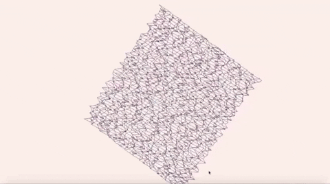

# Graphic Wireframe Representation Program
This project is about creating a simplified 3D graphic representation of a relief landscape. The 3D representation of a landscape is a critical aspect of modern mapping. This project has allowed me to learn how to place points in space, how to join them with segments and how to observe the scene from a particular viewpoint.

This project is written in C and uses the graphic library [miniLibX](minilibx_macos). Developed by Olivier Crouzet, miniLibX library allows users to open a window, light a pixel, and deal with keyboard and mouse.

_Note_: The miniLibX library used in this repository is made for MacOS. In order to use it on Linux, please refer to [here](https://github.com/42Paris/minilibx-linux).

## How to run the program
1. [Clone](https://help.github.com/articles/cloning-a-repository/) your fork of the repository onto your local computer.
```
git clone https://github.com/mjaything/graphic-wireframe.git
```

2. Navigate into the cloned repository.
```
cd graphic-wireframe
```

3. Run [make](https://www.gnu.org/software/make/manual/make.html).
```
make
```

4. Run the executable with a map file. Sample maps are located in the [maps](https://github.com/mjaything/graphic-wireframe/tree/master/maps) directory.
```
./fdf MAP_FILE
```

_Note_: 'fdf' is an abbreviation of 'fils de fer', which means 'wireframe' in French

## Examples
50-4
<br/>
```
./fdf maps/50.4.fdf
```


Pylone
<br/>
```
./fdf maps/pylone.fdf
```


## Acknowledgements
Sample maps are provided by [42](https://www.42.fr/).

## License
This work is published under the terms of **[42 Unlicense](https://github.com/gcamerli/42unlicense)**.
